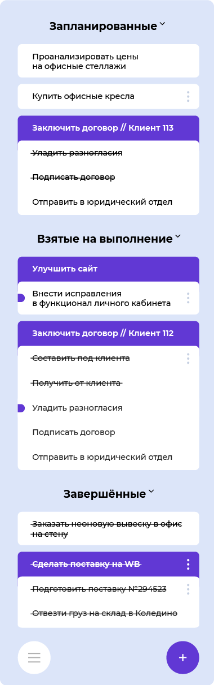

# Менеджер задач

Бэкенд на Java для трекера задач. Программа отвечает за формирование модели данных для такого прототипа:

## Приветственный экран

Когда задач не добавлено, выводится приветственный экран.

<pre><code>[!] Список задач пуст

СОЗДАТЬ ЗАДАЧУ:
1 — простую
2 — с подзадачами
0 — выйти</code></pre>

### Меню «Создать задачу»

В меню доступно создание простой задачи или задачи с подзадачами.

<pre><code>[!] Список задач пуст

СОЗДАТЬ ЗАДАЧУ:
1 — простую
2 — с подзадачами
0 — выйти</code></pre>

### Команда «Выйти»

Команда завершает программу.

<pre><code>[!] Список задач пуст

СОЗДАТЬ ЗАДАЧУ:
1 — простую
2 — с подзадачами
0 — выйти
0
Программа завершена</code></pre>

## Рабочая область

Если в памяти программы есть задачи, вместо приветственного экрана отображается рабочая область c секциями
«Запланированные», «Взятые на выполнение», «Завершённые» и списком доступных команд: вызвать меню задачи, вызвать меню
программы, создать задачу или завершить работу программы.

В каждой секции выводятся задачи соответствующего статуса: NEW в секции «Запланированные», IN_PROCESS — в секции «Взятые
на выполнение» или DONE в секции «Завершённые».

<pre><code>ЗАПЛАНИРОВАННЫЕ
id[1] Отправить презентацию Святославу (см. детали) | NEW
id[2] Исправить баг с изменением пароля | NEW

id[7] Создать страницу продукта | NEW
  ↳id[8] Создать макет страницы | NEW
  ↳id[9] Подготовить тексты и изображения | NEW
  ↳id[10] Сверстать страницу | NEW

ВЗЯТЫЕ НА ВЫПОЛНЕНИЕ
id[4] Подготовить ТЗ | IN_PROCESS
  ↳id[5] Написать текст ТЗ (см. детали) | IN_PROCESS
  ↳id[6] Собрать ресурсы в помощь (см. детали) | NEW

ЗАВЕРШЁННЫЕ
id[3] Созвониться по видео с новенькими в команде | DONE

Введите:
номер id[] — вызвать меню задачи
m — вызвать меню программы
t — создать задачу
q — выйти</code></pre>

По номеру задачи вызывается её контекстное меню, команды в виде букв m, t, q вызывают соответствующие действия.

Если ввести что-то иное, программа укажет на ошибку ввода.

Предупреждение, если ввести словесную команду, которой не существует:

<pre><code>Введите:
номер id[] — вызвать меню задачи
m — вызвать меню программы
t — создать задачу
q — выйти
sdf
[!] Ожидается ввод команды из предложенных
Введите:
номер id[] — вызвать меню задачи
m — вызвать меню программы
t — создать задачу
q — выйти</code></pre>

Предупреждение, если ввести номер задачи, которой нет:
<pre><code>ЗАПЛАНИРОВАННЫЕ
id[1] Отправить презентацию Святославу (см. детали) | NEW
id[2] Исправить баг с изменением пароля | NEW
id[3] Созвониться по видео с новенькими в команде | NEW

id[4] Подготовить ТЗ | NEW
  ↳id[5] Написать текст ТЗ (см. детали) | NEW
  ↳id[6] Собрать ресурсы в помощь (см. детали) | NEW

id[7] Создать страницу продукта | NEW
  ↳id[8] Создать макет страницы | NEW
  ↳id[9] Подготовить тексты и изображения | NEW
  ↳id[10] Сверстать страницу | NEW

ВЗЯТЫЕ НА ВЫПОЛНЕНИЕ
Нет задач такого типа

ЗАВЕРШЁННЫЕ
Нет задач такого типа

Введите:
номер id[] — вызвать меню задачи
m — вызвать меню программы
t — создать задачу
q — выйти
99
[!] Нет задачи с таким id[]
Введите:
номер id[] — вызвать меню задачи
m — вызвать меню программы
t — создать задачу
q — выйти</code></pre>

Если ввести номер задачи, которая существует, программа покажет её контекстное меню.

## Контекстное меню задачи

Контекстное меню задачи выводит детали по задаче и доступные действия, в зависимости от её типа и статуса. Всего
предусмотрено 7 вариаций контекстного меню задачи.

### Контекстное меню для обычной задачи

Обычная задача — задача без подзадач.

Возможные статусы обычной задачи:
* NEW — добавлена, но не взята на выполнение
* IN_PROCESS — взята на выполнение, но не завершена
* DONE — завершена

Какие действия доступны в контекстном меню задачи, зависит от статуса задачи.

#### Контекстное меню для обычной задачи со статусом NEW

<pre><code>ЗАПЛАНИРОВАННЫЕ
id[1] Отправить презентацию Святославу (см. детали) | NEW

id[4] Подготовить ТЗ | NEW
  ↳id[5] Написать текст ТЗ (см. детали) | NEW
  ↳id[6] Собрать ресурсы в помощь (см. детали) | NEW

ВЗЯТЫЕ НА ВЫПОЛНЕНИЕ
Нет задач такого типа

ЗАВЕРШЁННЫЕ
Нет задач такого типа

Введите:
номер id[] — вызвать меню задачи
m — вызвать меню программы
t — создать задачу
q — выйти
1
МЕНЮ ЗАДАЧИ
id[1] Отправить презентацию Святославу | NEW
Детали: @svyat_svyat_svyat

ЧТО СДЕЛАТЬ С ЭТОЙ ЗАДАЧЕЙ?
1 — добавить к ней подзадачу
2 — перенести в подзадачи к другой задаче
3 — удалить
4 — пометить взятой на выполнение
5 — пометить завершённой
0 — выйти из меню задачи</code></pre>

#### Контекстное меню для обычной задачи со статусом IN_PROCESS

<pre><code>ЗАПЛАНИРОВАННЫЕ
id[4] Подготовить ТЗ | NEW
  ↳id[5] Написать текст ТЗ (см. детали) | NEW
  ↳id[6] Собрать ресурсы в помощь (см. детали) | NEW

ВЗЯТЫЕ НА ВЫПОЛНЕНИЕ
id[1] Отправить презентацию Святославу (см. детали) | IN_PROCESS

ЗАВЕРШЁННЫЕ
Нет задач такого типа

Введите:
номер id[] — вызвать меню задачи
m — вызвать меню программы
t — создать задачу
q — выйти
1
МЕНЮ ЗАДАЧИ
id[1] Отправить презентацию Святославу | IN_PROCESS
Детали: @svyat_svyat_svyat

ЧТО СДЕЛАТЬ С ЭТОЙ ЗАДАЧЕЙ?
1 — перенести в подзадачи к другой задаче
2 — удалить
3 — пометить завершённой
0 — выйти из меню задачи</code></pre>

#### Контекстное меню для обычной задачи со статусом DONE

<pre><code>ЗАПЛАНИРОВАННЫЕ
id[4] Подготовить ТЗ | NEW
  ↳id[5] Написать текст ТЗ (см. детали) | NEW
  ↳id[6] Собрать ресурсы в помощь (см. детали) | NEW

ВЗЯТЫЕ НА ВЫПОЛНЕНИЕ
Нет задач такого типа

ЗАВЕРШЁННЫЕ
id[1] Отправить презентацию Святославу (см. детали) | DONE

Введите:
номер id[] — вызвать меню задачи
m — вызвать меню программы
t — создать задачу
q — выйти
1
МЕНЮ ЗАДАЧИ
id[1] Отправить презентацию Святославу | DONE
Детали: @svyat_svyat_svyat

ЧТО СДЕЛАТЬ С ЭТОЙ ЗАДАЧЕЙ?
1 — удалить
2 — вернуть задаче статус взятой на выполнение
0 — выйти из меню задачи</code></pre>

### Контекстное меню для задачи с подзадачами

Задача с её подзадачами с одной стороны является единой сущностью, с другой стороны каждая из подзадач ведёт себя похоже
на обычную задачу — можно вызвать контектное меню для подзадачи.

Статус родительской задачи зависит от статусов её подзадач: нельзя напрямую поменять статус родительской задачи, но
можно влиять на него, меняя статусы подзадач.

<table>
	<tbody>
		<tr>
			<td rowspan="2">№ ситуации</td><td colspan="3">Статус подзадач</td><td rowspan="2">Статус родительской задачи</td>
		</tr>
		<tr>
			<td>Подзадача 1</td><td>Подзадача 2</td><td>Подзадача 3</td>
		</tr>
		<tr>
			<td>1</td>
			<td>NEW</td>
			<td>NEW</td>
			<td>NEW</td>
			<td>NEW</td>
		</tr>
		<tr>
			<td>2</td>
			<td>IN_PROCESS</td>
			<td>NEW</td>
			<td>NEW</td>
			<td>IN_PROCESS</td>
		</tr>
		<tr>
			<td>3</td>
			<td>DONE</td>
			<td>NEW</td>
			<td>NEW</td>
			<td>NEW</td>
		</tr>
		<tr>
			<td>4</td>
			<td>NEW</td>
			<td>IN_PROCESS</td>
			<td>NEW</td>
			<td>IN_PROCESS</td>
		</tr>
		<tr>
			<td>5</td>
			<td>IN_PROCESS</td>
			<td>IN_PROCESS</td>
			<td>NEW</td>
			<td>IN_PROCESS</td>
		</tr>
		<tr>
			<td>6</td>
			<td>DONE</td>
			<td>IN_PROCESS</td>
			<td>NEW</td>
			<td>IN_PROCESS</td>
		</tr>
		<tr>
			<td>7</td>
			<td>NEW</td>
			<td>DONE</td>
			<td>NEW</td>
			<td>NEW</td>
		</tr>
		<tr>
			<td>8</td>
			<td>IN_PROCESS</td>
			<td>DONE</td>
			<td>NEW</td>
			<td>IN_PROCESS</td>
		</tr>
		<tr>
			<td>9</td>
			<td>DONE</td>
			<td>DONE</td>
			<td>NEW</td>
			<td>NEW</td>
		</tr>
		<tr>
			<td>10</td>
			<td>NEW</td>
			<td>NEW</td>
			<td>IN_PROCESS</td>
			<td>IN_PROCESS</td>
		</tr>
		<tr>
			<td>11</td>
			<td>IN_PROCESS</td>
			<td>NEW</td>
			<td>IN_PROCESS</td>
			<td>IN_PROCESS</td>
		</tr>
		<tr>
			<td>12</td>
			<td>DONE</td>
			<td>NEW</td>
			<td>IN_PROCESS</td>
			<td>IN_PROCESS</td>
		</tr>
		<tr>
			<td>13</td>
			<td>NEW</td>
			<td>IN_PROCESS</td>
			<td>IN_PROCESS</td>
			<td>IN_PROCESS</td>
		</tr>
		<tr>
			<td>14</td>
			<td>IN_PROCESS</td>
			<td>IN_PROCESS</td>
			<td>IN_PROCESS</td>
			<td>IN_PROCESS</td>
		</tr>
		<tr>
			<td>15</td>
			<td>DONE</td>
			<td>IN_PROCESS</td>
			<td>IN_PROCESS</td>
			<td>IN_PROCESS</td>
		</tr>
		<tr>
			<td>16</td>
			<td>NEW</td>
			<td>DONE</td>
			<td>IN_PROCESS</td>
			<td>IN_PROCESS</td>
		</tr>
		<tr>
			<td>17</td>
			<td>IN_PROCESS</td>
			<td>DONE</td>
			<td>IN_PROCESS</td>
			<td>IN_PROCESS</td>
		</tr>
		<tr>
			<td>18</td>
			<td>DONE</td>
			<td>DONE</td>
			<td>IN_PROCESS</td>
			<td>IN_PROCESS</td>
		</tr>
		<tr>
			<td>19</td>
			<td>NEW</td>
			<td>NEW</td>
			<td>DONE</td>
			<td>NEW</td>
		</tr>
		<tr>
			<td>20</td>
			<td>IN_PROCESS</td>
			<td>NEW</td>
			<td>DONE</td>
			<td>IN_PROCESS</td>
		</tr>
		<tr>
			<td>21</td>
			<td>DONE</td>
			<td>NEW</td>
			<td>DONE</td>
			<td>NEW</td>
		</tr>
		<tr>
			<td>22</td>
			<td>NEW</td>
			<td>IN_PROCESS</td>
			<td>DONE</td>
			<td>IN_PROCESS</td>
		</tr>
		<tr>
			<td>23</td>
			<td>IN_PROCESS</td>
			<td>IN_PROCESS</td>
			<td>DONE</td>
			<td>IN_PROCESS</td>
		</tr>
		<tr>
			<td>24</td>
			<td>DONE</td>
			<td>IN_PROCESS</td>
			<td>DONE</td>
			<td>IN_PROCESS</td>
		</tr>
		<tr>
			<td>25</td>
			<td>NEW</td>
			<td>DONE</td>
			<td>DONE</td>
			<td>NEW</td>
		</tr>
		<tr>
			<td>26</td>
			<td>IN_PROCESS</td>
			<td>DONE</td>
			<td>DONE</td>
			<td>IN_PROCESS</td>
		</tr>
		<tr>
			<td>27</td>
			<td>DONE</td>
			<td>DONE</td>
			<td>DONE</td>
			<td>DONE</td>
		</tr>
	</tbody>
</table>

Из таблицы видно, что задача с подзадачами:
* имеет статус DONE только в случае такого статуса у всех её подзадач
* имеет статус IN_PROCESS, когда хотя бы одна из её подзадач имеет статус IN_PROCESS
* имеет статус NEW, когда нет ни единой подзадачи со статусом IN_PROCESS, и есть хотя бы одна подзадача со статусом NEW.

Так как статус задачи с подзадачами нельзя менять напрямую, контекстное меню задачи с подзадачами такое:

<pre><code>ЗАПЛАНИРОВАННЫЕ
id[4] Подготовить ТЗ | NEW  
  ↳id[5] Написать текст ТЗ (см. детали) | NEW
  ↳id[6] Собрать ресурсы в помощь (см. детали) | NEW

ВЗЯТЫЕ НА ВЫПОЛНЕНИЕ
Нет задач такого типа

ЗАВЕРШЁННЫЕ
id[1] Отправить презентацию Святославу (см. детали) | DONE

Введите:
номер id[] — вызвать меню задачи
m — вызвать меню программы
t — создать задачу
q — выйти
4
МЕНЮ ЗАДАЧИ
id[4] Подготовить ТЗ | NEW
Подзадачи (2):
  ↳id[5] Написать текст ТЗ (см. детали) | NEW
  ↳id[6] Собрать ресурсы в помощь (см. детали) | NEW

ЧТО СДЕЛАТЬ С ЭТОЙ ЗАДАЧЕЙ?
1 — удалить вместе с подзадачами
2 — добавить подзадачу
0 — выйти из меню задачи</code></pre>

###Контекстное меню для подзадачи

Подзадача — обычная задача, которая имеет родительскую задачу.

Возможные статусы обычной задачи:
* NEW — добавлена, но не взята на выполнение
* IN_PROCESS — взята на выполнение, но не завершена
* DONE — завершена

Какие действия доступны в контекстном меню подзадачи, зависит от статуса подзадачи.

####Контекстное меню подзадачи со статусом NEW
<pre><code>ЗАПЛАНИРОВАННЫЕ
id[4] Подготовить ТЗ | NEW
  ↳id[5] Написать текст ТЗ (см. детали) | NEW
  ↳id[6] Собрать ресурсы в помощь (см. детали) | NEW

ВЗЯТЫЕ НА ВЫПОЛНЕНИЕ
id[1] Отправить презентацию Святославу (см. детали) | IN_PROCESS

ЗАВЕРШЁННЫЕ
Нет задач такого типа

Введите:
номер id[] — вызвать меню задачи
m — вызвать меню программы
t — создать задачу
q — выйти
5
МЕНЮ ЗАДАЧИ
↳id[5] Написать текст ТЗ | NEW
Детали: Что сделать, требования, ресурсы, в каком виде нужен результат
Родительская задача: id[4] Подготовить ТЗ | NEW

ЧТО СДЕЛАТЬ С ПОДЗАДАЧЕЙ id[5]?
1 — удалить
2 — пометить взятой на выполнение
3 — пометить завершённой
0 — выйти из меню задачи</code></pre>

####Контекстное меню подзадачи со статусом IN_PROCESS
<pre><code>ЗАПЛАНИРОВАННЫЕ
Нет задач такого типа

ВЗЯТЫЕ НА ВЫПОЛНЕНИЕ
id[1] Отправить презентацию Святославу (см. детали) | IN_PROCESS

id[4] Подготовить ТЗ | IN_PROCESS
  ↳id[5] Написать текст ТЗ (см. детали) | IN_PROCESS
  ↳id[6] Собрать ресурсы в помощь (см. детали) | NEW

ЗАВЕРШЁННЫЕ
Нет задач такого типа

Введите:
номер id[] — вызвать меню задачи
m — вызвать меню программы
t — создать задачу
q — выйти
5
МЕНЮ ЗАДАЧИ
↳id[5] Написать текст ТЗ | IN_PROCESS
Детали: Что сделать, требования, ресурсы, в каком виде нужен результат
Родительская задача: id[4] Подготовить ТЗ | IN_PROCESS

ЧТО СДЕЛАТЬ С ПОДЗАДАЧЕЙ id[5]?
1 — удалить
2 — пометить завершённой
0 — выйти из меню задачи</code></pre>

####Контекстное меню подзадачи со статусом DONE
<pre><code>ЗАПЛАНИРОВАННЫЕ
id[4] Подготовить ТЗ | NEW
  ↳id[5] Написать текст ТЗ (см. детали) | DONE
  ↳id[6] Собрать ресурсы в помощь (см. детали) | NEW

ВЗЯТЫЕ НА ВЫПОЛНЕНИЕ
id[1] Отправить презентацию Святославу (см. детали) | IN_PROCESS

ЗАВЕРШЁННЫЕ
Нет задач такого типа

Введите:
номер id[] — вызвать меню задачи
m — вызвать меню программы
t — создать задачу
q — выйти
5
МЕНЮ ЗАДАЧИ
↳id[5] Написать текст ТЗ | DONE
Детали: Что сделать, требования, ресурсы, в каком виде нужен результат
Родительская задача: id[4] Подготовить ТЗ | NEW

ЧТО СДЕЛАТЬ С ПОДЗАДАЧЕЙ id[5]?
1 — удалить
2 — вернуть задаче статус взятой на выполнение
0 — выйти из меню задачи
</code></pre>

##Действия, доступные для задач из их контекстного меню
###Команда «Удалить»
Доступна для задач всех типов и статусов. Удаляет задачу.

<pre><code>ЗАПЛАНИРОВАННЫЕ
id[4] Подготовить ТЗ | NEW
  ↳id[5] Написать текст ТЗ (см. детали) | DONE
  ↳id[6] Собрать ресурсы в помощь (см. детали) | NEW

ВЗЯТЫЕ НА ВЫПОЛНЕНИЕ
id[1] Отправить презентацию Святославу (см. детали) | IN_PROCESS

ЗАВЕРШЁННЫЕ
Нет задач такого типа

Введите:
номер id[] — вызвать меню задачи
m — вызвать меню программы
t — создать задачу
q — выйти
1
МЕНЮ ЗАДАЧИ
id[1] Отправить презентацию Святославу | IN_PROCESS
Детали: @svyat_svyat_svyat

ЧТО СДЕЛАТЬ С ЭТОЙ ЗАДАЧЕЙ?
1 — перенести в подзадачи к другой задаче
2 — удалить
3 — пометить завершённой
0 — выйти из меню задачи
2
УДАЛИТЬ
Задача id[1] «Отправить презентацию Святославу» удалена
Нажмите любую клавишу, чтобы продолжить

ЗАПЛАНИРОВАННЫЕ
id[4] Подготовить ТЗ | NEW
  ↳id[5] Написать текст ТЗ (см. детали) | DONE
  ↳id[6] Собрать ресурсы в помощь (см. детали) | NEW

ВЗЯТЫЕ НА ВЫПОЛНЕНИЕ
Нет задач такого типа

ЗАВЕРШЁННЫЕ
Нет задач такого типа

Введите:
номер id[] — вызвать меню задачи
m — вызвать меню программы
t — создать задачу
q — выйти</code></pre>

Задачи с подзадачами удаляются целиком со своими подзадачами.
<pre><code>ЗАПЛАНИРОВАННЫЕ
id[2] Исправить баг с изменением пароля | NEW

id[4] Подготовить ТЗ | NEW
  ↳id[5] Написать текст ТЗ (см. детали) | NEW
  ↳id[6] Собрать ресурсы в помощь (см. детали) | NEW

ВЗЯТЫЕ НА ВЫПОЛНЕНИЕ
Нет задач такого типа

ЗАВЕРШЁННЫЕ
Нет задач такого типа

Введите:
номер id[] — вызвать меню задачи
m — вызвать меню программы
t — создать задачу
q — выйти
4
МЕНЮ ЗАДАЧИ
id[4] Подготовить ТЗ | NEW
Подзадачи (2):
  ↳id[5] Написать текст ТЗ (см. детали) | NEW
  ↳id[6] Собрать ресурсы в помощь (см. детали) | NEW

ЧТО СДЕЛАТЬ С ЭТОЙ ЗАДАЧЕЙ?
1 — удалить вместе с подзадачами
2 — добавить подзадачу
0 — выйти из меню задачи
1
УДАЛИТЬ ВМЕСТЕ С ПОДЗАДАЧАМИ
Удалить задачу id[4] «Подготовить ТЗ»  вместе с подзадачами?
1 — да, 0 — нет
1
Задача id[4] «Подготовить ТЗ» окончательно удалена со своими подзадачами
Нажмите любую клавишу, чтобы продолжить

ЗАПЛАНИРОВАННЫЕ
id[2] Исправить баг с изменением пароля | NEW

ВЗЯТЫЕ НА ВЫПОЛНЕНИЕ
Нет задач такого типа

ЗАВЕРШЁННЫЕ
Нет задач такого типа

Введите:
номер id[] — вызвать меню задачи
m — вызвать меню программы
t — создать задачу
q — выйти</code></pre>

Если удалить у задачи с подзадачами её последнюю подзадачу, то такая задача станет обычной.

<pre><code>ЗАПЛАНИРОВАННЫЕ
id[1] Отправить презентацию Святославу (см. детали) | NEW
id[2] Исправить баг с изменением пароля | NEW

id[4] Подготовить ТЗ | NEW
  ↳id[5] Написать текст ТЗ (см. детали) | NEW

ВЗЯТЫЕ НА ВЫПОЛНЕНИЕ
Нет задач такого типа

ЗАВЕРШЁННЫЕ
Нет задач такого типа

Введите:
номер id[] — вызвать меню задачи
m — вызвать меню программы
t — создать задачу
q — выйти
5
МЕНЮ ЗАДАЧИ
↳id[5] Написать текст ТЗ | NEW
Детали: Что сделать, требования, ресурсы, в каком виде нужен результат
Родительская задача: id[4] Подготовить ТЗ | NEW

ЧТО СДЕЛАТЬ С ПОДЗАДАЧЕЙ id[5]?
1 — удалить
2 — пометить взятой на выполнение
3 — пометить завершённой
0 — выйти из меню задачи
1
УДАЛИТЬ
id[4] Подготовить ТЗ | NEW
→ ↳id[5] Написать текст ТЗ (см.—детали) | NEW

Удалить подзадачу id[5]?
1 — да, 0 — нет
1
Подзадача ↳id[5] «Написать текст ТЗ» удалена
Нажмите любую клавишу, чтобы продолжить

ЗАПЛАНИРОВАННЫЕ
id[1] Отправить презентацию Святославу (см. детали) | NEW
id[2] Исправить баг с изменением пароля | NEW
id[4] Подготовить ТЗ | NEW

ВЗЯТЫЕ НА ВЫПОЛНЕНИЕ
Нет задач такого типа

ЗАВЕРШЁННЫЕ
Нет задач такого типа

Введите:
номер id[] — вызвать меню задачи
m — вызвать меню программы
t — создать задачу
q — выйти
</code></pre>

###Команда «Перенести в подзадачи к другой задаче»

Доступна для обычных задач со статусами NEW и IN_PROCESS.

Переносит задачу в подзадачи к другой задаче.

Если у родительской задачи уже есть подзадачи, выбранная задача добавляется в конец списка подзадач и меняет свой тип с обычной задачи на подзадачу.

<pre><code>ЗАПЛАНИРОВАННЫЕ
id[13] Сверстать продуктовую страницу | NEW

id[4] Подготовить ТЗ | NEW
  ↳id[5] Написать текст ТЗ (см. детали) | NEW
  ↳id[6] Собрать ресурсы в помощь (см. детали) | NEW

id[7] Создать страницу продукта | NEW
  ↳id[8] Создать макет страницы | NEW
  ↳id[9] Подготовить тексты и изображения | NEW

ВЗЯТЫЕ НА ВЫПОЛНЕНИЕ
Нет задач такого типа

ЗАВЕРШЁННЫЕ
Нет задач такого типа

Введите:
номер id[] — вызвать меню задачи
m — вызвать меню программы
t — создать задачу
q — выйти
13
МЕНЮ ЗАДАЧИ
id[13] Сверстать продуктовую страницу | NEW

ЧТО СДЕЛАТЬ С ЭТОЙ ЗАДАЧЕЙ?
1 — добавить к ней подзадачу
2 — перенести в подзадачи к другой задаче
3 — удалить
4 — пометить взятой на выполнение
5 — пометить завершённой
0 — выйти из меню задачи
2
ПЕРЕНЕСТИ В ПОДЗАДАЧИ К ДРУГОЙ ЗАДАЧЕ
id[13] Сверстать продуктовую страницу | NEW
↓
В подзадачи к какой задаче добавить:
? id[4] Подготовить ТЗ | NEW
? id[7] Создать страницу продукта | NEW
↑
Введите номер id[] задачи, в подзадачи к которой
добавить задачу id[13] «Сверстать продуктовую страницу»,
или 0, чтобы вернуться назад:
7
Задача перенесена в подзадачи
id[7] Создать страницу продукта | NEW
  ↳id[8] Создать макет страницы | NEW
  ↳id[9] Подготовить тексты и изображения | NEW
  ↳id[13] Сверстать продуктовую страницу | NEW — добавлено сейчас

Нажмите любую клавишу, чтобы продолжить

ЗАПЛАНИРОВАННЫЕ
id[4] Подготовить ТЗ | NEW
  ↳id[5] Написать текст ТЗ (см. детали) | NEW
  ↳id[6] Собрать ресурсы в помощь (см. детали) | NEW

id[7] Создать страницу продукта | NEW
  ↳id[8] Создать макет страницы | NEW
  ↳id[9] Подготовить тексты и изображения | NEW
  ↳id[13] Сверстать продуктовую страницу | NEW

ВЗЯТЫЕ НА ВЫПОЛНЕНИЕ
Нет задач такого типа

ЗАВЕРШЁННЫЕ
Нет задач такого типа

Введите:
номер id[] — вызвать меню задачи
m — вызвать меню программы
t — создать задачу
q — выйти</code></pre>

###Команда «Добавить подзадачу»
Доступна для задачи с подзадачами, статус может быть любой.

Добавляет подзадачу в конец списка подзадач конкретной задачи.
<pre><code>ЗАПЛАНИРОВАННЫЕ
id[4] Подготовить ТЗ | NEW
  ↳id[5] Написать текст ТЗ (см. детали) | NEW
  ↳id[6] Собрать ресурсы в помощь (см. детали) | NEW

ВЗЯТЫЕ НА ВЫПОЛНЕНИЕ
Нет задач такого типа

ЗАВЕРШЁННЫЕ
Нет задач такого типа

Введите:
номер id[] — вызвать меню задачи
m — вызвать меню программы
t — создать задачу
q — выйти
4
МЕНЮ ЗАДАЧИ
id[4] Подготовить ТЗ | NEW
Подзадачи (2):
  ↳id[5] Написать текст ТЗ (см. детали) | NEW
  ↳id[6] Собрать ресурсы в помощь (см. детали) | NEW

ЧТО СДЕЛАТЬ С ЭТОЙ ЗАДАЧЕЙ?
1 — удалить вместе с подзадачами
2 — добавить подзадачу
0 — выйти из меню задачи
2
ДОБАВИТЬ ПОДЗАДАЧУ
id[4] Подготовить ТЗ | NEW
  ↳id[5] Написать текст ТЗ (см. детали) | NEW
  ↳id[6] Собрать ресурсы в помощь (см. детали) | NEW
  ↳ добавить сюда подзадачу
		↑
Заголовок: Подобрать исполнителя
Описание (если нужно): 
id[4] Подготовить ТЗ | NEW
  ↳id[5] Написать текст ТЗ (см. детали) | NEW
  ↳id[6] Собрать ресурсы в помощь (см. детали) | NEW
  ↳id[13] Подобрать исполнителя | NEW — добавлено сейчас

Нажмите любую клавишу, чтобы продолжить

ЗАПЛАНИРОВАННЫЕ
id[4] Подготовить ТЗ | NEW
  ↳id[5] Написать текст ТЗ (см. детали) | NEW
  ↳id[6] Собрать ресурсы в помощь (см. детали) | NEW
  ↳id[13] Подобрать исполнителя | NEW

ВЗЯТЫЕ НА ВЫПОЛНЕНИЕ
Нет задач такого типа

ЗАВЕРШЁННЫЕ
Нет задач такого типа

Введите:
номер id[] — вызвать меню задачи
m — вызвать меню программы
t — создать задачу
q — выйти
</code></pre>

###Команда изменения статуса задачи на IN_PROCESS

В контекстном меню в зависимости от текущего статуса задачи, формулировки различаются.

У обычной задачи и подзадачи со статусами NEW формулировка команды: «Пометить взятой на исполнение».

<pre><code>ЗАПЛАНИРОВАННЫЕ
id[1] Отправить презентацию Святославу (см. детали) | NEW
id[2] Исправить баг с изменением пароля | NEW
id[3] Созвониться по видео с новенькими в команде | NEW

ВЗЯТЫЕ НА ВЫПОЛНЕНИЕ
Нет задач такого типа

ЗАВЕРШЁННЫЕ
Нет задач такого типа

Введите:
номер id[] — вызвать меню задачи
m — вызвать меню программы
t — создать задачу
q — выйти
1
МЕНЮ ЗАДАЧИ
id[1] Отправить презентацию Святославу | NEW
Детали: @svyat_svyat_svyat

ЧТО СДЕЛАТЬ С ЭТОЙ ЗАДАЧЕЙ?
1 — добавить к ней подзадачу
2 — перенести в подзадачи к другой задаче
3 — удалить
4 — пометить взятой на выполнение
5 — пометить завершённой
0 — выйти из меню задачи
4
ПОМЕТИТЬ ВЗЯТОЙ НА ВЫПОЛНЕНИЕ
Статус задачи id[1] «Отправить презентацию Святославу» изменён:
NEW → IN_PROCESS
Нажмите любую клавишу, чтобы продолжить

ЗАПЛАНИРОВАННЫЕ
id[2] Исправить баг с изменением пароля | NEW
id[3] Созвониться по видео с новенькими в команде | NEW

ВЗЯТЫЕ НА ВЫПОЛНЕНИЕ
id[1] Отправить презентацию Святославу (см. детали) | IN_PROCESS

ЗАВЕРШЁННЫЕ
Нет задач такого типа

Введите:
номер id[] — вызвать меню задачи
m — вызвать меню программы
t — создать задачу
q — выйти
</code></pre>

У обычной задачи или подзадачи со статусами DONE формулировка команды: «Вернуть задаче статус взятой на выполнение».

<pre><code>ЗАПЛАНИРОВАННЫЕ
id[2] Исправить баг с изменением пароля | NEW
id[3] Созвониться по видео с новенькими в команде | NEW

ВЗЯТЫЕ НА ВЫПОЛНЕНИЕ
Нет задач такого типа

ЗАВЕРШЁННЫЕ
id[1] Отправить презентацию Святославу (см. детали) | DONE

Введите:
номер id[] — вызвать меню задачи
m — вызвать меню программы
t — создать задачу
q — выйти
1
МЕНЮ ЗАДАЧИ
id[1] Отправить презентацию Святославу | DONE
Детали: @svyat_svyat_svyat

ЧТО СДЕЛАТЬ С ЭТОЙ ЗАДАЧЕЙ?
1 — удалить
2 — вернуть задаче статус взятой на выполнение
0 — выйти из меню задачи
2
СНОВА ПОМЕТИТЬ ВЗЯТОЙ НА ВЫПОЛНЕНИЕ
Статус задачи id[1] «Отправить презентацию Святославу» изменён:
DONE → IN_PROCESS
Нажмите любую клавишу, чтобы продолжить

ЗАПЛАНИРОВАННЫЕ
id[2] Исправить баг с изменением пароля | NEW
id[3] Созвониться по видео с новенькими в команде | NEW

ВЗЯТЫЕ НА ВЫПОЛНЕНИЕ
id[1] Отправить презентацию Святославу (см. детали) | IN_PROCESS

ЗАВЕРШЁННЫЕ
Нет задач такого типа

Введите:
номер id[] — вызвать меню задачи
m — вызвать меню программы
t — создать задачу
q — выйти
</code></pre>

Если статус подзадачи меняется на IN_PROCESS, автоматически меняется статус её родительской задачи на такой же.

###Команда «Пометить завершённой»

Доступна для обычных задач и подзадач со статусами NEW и IN_PROCESS. Меняет статус задачи или подзадачи на DONE.

Если задача или подзадача имеют статус IN_PROCESS, то они помечаются DONE за одно действие.

<pre><code>ЗАПЛАНИРОВАННЫЕ
id[2] Исправить баг с изменением пароля | NEW
id[3] Созвониться по видео с новенькими в команде | NEW

ВЗЯТЫЕ НА ВЫПОЛНЕНИЕ
id[1] Отправить презентацию Святославу (см. детали) | IN_PROCESS

ЗАВЕРШЁННЫЕ
Нет задач такого типа

Введите:
номер id[] — вызвать меню задачи
m — вызвать меню программы
t — создать задачу
q — выйти
1
МЕНЮ ЗАДАЧИ
id[1] Отправить презентацию Святославу | IN_PROCESS
Детали: @svyat_svyat_svyat

ЧТО СДЕЛАТЬ С ЭТОЙ ЗАДАЧЕЙ?
1 — перенести в подзадачи к другой задаче
2 — удалить
3 — пометить завершённой
0 — выйти из меню задачи
3
ПОМЕТИТЬ ЗАВЕРШЁННОЙ
Статус задачи id[1] «Отправить презентацию Святославу» изменён:
IN_PROCESS → DONE
Нажмите любую клавишу, чтобы продолжить

ЗАПЛАНИРОВАННЫЕ
id[2] Исправить баг с изменением пароля | NEW
id[3] Созвониться по видео с новенькими в команде | NEW

ВЗЯТЫЕ НА ВЫПОЛНЕНИЕ
Нет задач такого типа

ЗАВЕРШЁННЫЕ
id[1] Отправить презентацию Святославу (см. детали) | DONE

Введите:
номер id[] — вызвать меню задачи
m — вызвать меню программы
t — создать задачу
q — выйти
</code></pre>

Если задача или подзадача имеют статус NEW, то сначала программа предложит пометить их статусом IN_PROCESS, и, только если пользователь настаивает, они помечаются статусом DONE.

<pre><code>ЗАПЛАНИРОВАННЫЕ
id[2] Исправить баг с изменением пароля | NEW
id[3] Созвониться по видео с новенькими в команде | NEW

ВЗЯТЫЕ НА ВЫПОЛНЕНИЕ
Нет задач такого типа

ЗАВЕРШЁННЫЕ
id[1] Отправить презентацию Святославу (см. детали) | DONE

Введите:
номер id[] — вызвать меню задачи
m — вызвать меню программы
t — создать задачу
q — выйти
2
МЕНЮ ЗАДАЧИ
id[2] Исправить баг с изменением пароля | NEW

ЧТО СДЕЛАТЬ С ЭТОЙ ЗАДАЧЕЙ?
1 — добавить к ней подзадачу
2 — перенести в подзадачи к другой задаче
3 — удалить
4 — пометить взятой на выполнение
5 — пометить завершённой
0 — выйти из меню задачи
5
ПОМЕТИТЬ ЗАВЕРШЁННОЙ
Задача id[2] «Исправить баг с изменением пароля» ещё не была на выполнении.
Всё равно пометить завершённой?
1 — да, 0 — нет, 2 — пометить взятой на выполнение
1
Статус задачи id[2] «Исправить баг с изменением пароля» изменён:
NEW → DONE
Нажмите любую клавишу, чтобы продолжить

ЗАПЛАНИРОВАННЫЕ
id[3] Созвониться по видео с новенькими в команде | NEW

ВЗЯТЫЕ НА ВЫПОЛНЕНИЕ
Нет задач такого типа

ЗАВЕРШЁННЫЕ
id[1] Отправить презентацию Святославу (см. детали) | DONE
id[2] Исправить баг с изменением пароля | DONE

Введите:
номер id[] — вызвать меню задачи
m — вызвать меню программы
t — создать задачу
q — выйти
</code></pre>

###Команда «Выйти из меню задачи»
Доступна для задач всех типов и статусов.

Позволяет выйти из контекстного меню задачи без совершения каких-либо действий с задачей.

<pre><code>ЗАПЛАНИРОВАННЫЕ
id[3] Созвониться по видео с новенькими в команде | NEW

ВЗЯТЫЕ НА ВЫПОЛНЕНИЕ
Нет задач такого типа

ЗАВЕРШЁННЫЕ
id[1] Отправить презентацию Святославу (см. детали) | DONE
id[2] Исправить баг с изменением пароля | DONE

Введите:
номер id[] — вызвать меню задачи
m — вызвать меню программы
t — создать задачу
q — выйти
3
МЕНЮ ЗАДАЧИ
id[3] Созвониться по видео с новенькими в команде | NEW

ЧТО СДЕЛАТЬ С ЭТОЙ ЗАДАЧЕЙ?
1 — добавить к ней подзадачу
2 — перенести в подзадачи к другой задаче
3 — удалить
4 — пометить взятой на выполнение
5 — пометить завершённой
0 — выйти из меню задачи
0
↓ возврат
Нажмите любую клавишу, чтобы продолжить

ЗАПЛАНИРОВАННЫЕ
id[3] Созвониться по видео с новенькими в команде | NEW

ВЗЯТЫЕ НА ВЫПОЛНЕНИЕ
Нет задач такого типа

ЗАВЕРШЁННЫЕ
id[1] Отправить презентацию Святославу (см. детали) | DONE
id[2] Исправить баг с изменением пароля | DONE

Введите:
номер id[] — вызвать меню задачи
m — вызвать меню программы
t — создать задачу
q — выйти
</code></pre>

##Меню программы
Помимо контекстного меню в рабочей области можно вызвать меню программы.

###Удалить все задачи
Действие удаляет все введённые в память менеджера задачи на текущий момент.
<pre><code>ЗАПЛАНИРОВАННЫЕ
id[1] Отправить презентацию Святославу (см. детали) | NEW
id[2] Исправить баг с изменением пароля | NEW
id[3] Созвониться по видео с новенькими в команде | NEW

id[4] Подготовить ТЗ | NEW
  ↳id[5] Написать текст ТЗ (см. детали) | NEW
  ↳id[6] Собрать ресурсы в помощь (см. детали) | NEW

id[7] Создать страницу продукта | NEW
  ↳id[8] Создать макет страницы | NEW
  ↳id[9] Подготовить тексты и изображения | NEW
  ↳id[10] Сверстать страницу | NEW

ВЗЯТЫЕ НА ВЫПОЛНЕНИЕ
Нет задач такого типа

ЗАВЕРШЁННЫЕ
Нет задач такого типа

Введите:
номер id[] — вызвать меню задачи
m — вызвать меню программы
t — создать задачу
q — выйти
m
НАСТРОЙКИ МЕНЕДЖЕРА ЗАДАЧ
1 — удалить все задачи
2 — история просмотра задач
0 — назад
1
УДАЛИТЬ ВСЕ ЗАДАЧИ
Удалить все задачи без возможности восстановления?
1 — да, 0 — нет
1
Все задачи удалены
[!] Список задач пуст

СОЗДАТЬ ЗАДАЧУ:
1 — простую
2 — с подзадачами
0 — выйти</code></pre>

###Посмотреть историю просмотров задач
Позволяет посмотреть последние 10 задач, с которыми любым способом взаимодействовал пользователь: вызывал меню задачи, менял её статус, пользовался любыми действиями, доступными задаче. 

Фиксируется каждый раз, когда пользователь взаимодействует с задачей: в истории просмотра могут быть дубли.

<pre><code>ЗАПЛАНИРОВАННЫЕ
id[2] Исправить баг с изменением пароля | NEW
id[3] Созвониться по видео с новенькими в команде | NEW

id[7] Создать страницу продукта | NEW
  ↳id[8] Создать макет страницы | NEW
  ↳id[9] Подготовить тексты и изображения | NEW
  ↳id[10] Сверстать страницу | NEW

ВЗЯТЫЕ НА ВЫПОЛНЕНИЕ
id[1] Отправить презентацию Святославу (см. детали) | IN_PROCESS

ЗАВЕРШЁННЫЕ
id[4] Подготовить ТЗ | DONE
  ↳id[5] Написать текст ТЗ (см. детали) | DONE
  ↳id[6] Собрать ресурсы в помощь (см. детали) | DONE

Введите:
номер id[] — вызвать меню задачи
m — вызвать меню программы
t — создать задачу
q — выйти
m
НАСТРОЙКИ МЕНЕДЖЕРА ЗАДАЧ
1 — удалить все задачи
2 — история просмотра задач
0 — назад
2
ИСТОРИЯ ПРОСМОТРА ЗАДАЧ
Последние 10 просмотренных задач (от старых к новым):
↳id[5] Написать текст ТЗ (см. детали) | DONE
↳id[6] Собрать ресурсы в помощь (см. детали) | DONE
↳id[5] Написать текст ТЗ (см. детали) | DONE
↳id[6] Собрать ресурсы в помощь (см. детали) | DONE
id[2] Исправить баг с изменением пароля | NEW
id[2] Исправить баг с изменением пароля | NEW
id[7] Создать страницу продукта | NEW
id[2] Исправить баг с изменением пароля | NEW
id[3] Созвониться по видео с новенькими в команде | NEW
id[1] Отправить презентацию Святославу (см. детали) | IN_PROCESS
Нажмите любую клавишу, чтобы продолжить
</code></pre>

##Команда «Создать задачу»
<pre><code>ЗАПЛАНИРОВАННЫЕ
id[1] Отправить презентацию Святославу (см. детали) | NEW
id[2] Исправить баг с изменением пароля | NEW
id[3] Созвониться по видео с новенькими в команде | NEW

ВЗЯТЫЕ НА ВЫПОЛНЕНИЕ
Нет задач такого типа

ЗАВЕРШЁННЫЕ
Нет задач такого типа

Введите:
номер id[] — вызвать меню задачи
m — вызвать меню программы
t — создать задачу
q — выйти
t
СОЗДАТЬ ЗАДАЧУ:
1 — простую
2 — с подзадачами
0 — назад
</code></pre>

Если в меню программы выбрать создание обычной задачи, создаётся однострочная задача.
<pre><code>ЗАПЛАНИРОВАННЫЕ
id[2] Исправить баг с изменением пароля | NEW
id[3] Созвониться по видео с новенькими в команде | NEW

ВЗЯТЫЕ НА ВЫПОЛНЕНИЕ
Нет задач такого типа

ЗАВЕРШЁННЫЕ
Нет задач такого типа

Введите:
номер id[] — вызвать меню задачи
m — вызвать меню программы
t — создать задачу
q — выйти
t
СОЗДАТЬ ЗАДАЧУ:
1 — простую
2 — с подзадачами
0 — назад
1
СОЗДАТЬ ПРОСТУЮ ЗАДАЧУ
Заголовок: Отправить презентацию Святославу
Описание (если нужно): @svyat_svyat_svyat
id[13] Отправить презентацию Святославу (см. детали) | NEW — добавлено сейчас
Нажмите любую клавишу, чтобы продолжить

ЗАПЛАНИРОВАННЫЕ
id[2] Исправить баг с изменением пароля | NEW
id[3] Созвониться по видео с новенькими в команде | NEW
id[13] Отправить презентацию Святославу (см. детали) | NEW

ВЗЯТЫЕ НА ВЫПОЛНЕНИЕ
Нет задач такого типа

ЗАВЕРШЁННЫЕ
Нет задач такого типа

Введите:
номер id[] — вызвать меню задачи
m — вызвать меню программы
t — создать задачу
q — выйти</code></pre>

Если в меню программы выбрать создание задачи с подзадачами, создаётся родительская задача со своей первой подзадачей.

<pre><code>ЗАПЛАНИРОВАННЫЕ
id[2] Исправить баг с изменением пароля | NEW
id[3] Созвониться по видео с новенькими в команде | NEW
id[13] Отправить презентацию Святославу (см. детали) | NEW

ВЗЯТЫЕ НА ВЫПОЛНЕНИЕ
Нет задач такого типа

ЗАВЕРШЁННЫЕ
Нет задач такого типа

Введите:
номер id[] — вызвать меню задачи
m — вызвать меню программы
t — создать задачу
q — выйти
t
СОЗДАТЬ ЗАДАЧУ:
1 — простую
2 — с подзадачами
0 — назад
2
СОЗДАТЬ ЗАДАЧУ С ПОДЗАДАЧАМИ
Заголовок: Забрать товар со склада
Описание (если нужно): Склад «Красные ворота», въезд 12, заказ #81503
id[14] Забрать товар со склада (см. детали) | NEW
  ↳ добавить сюда подзадачу
		↑
Заголовок: Зарезервировать фургон с водителем
Описание (если нужно): 
id[14] Забрать товар со склада (см. детали) | NEW
  ↳id[15] Зарезервировать фургон с водителем | NEW — добавлено сейчас

Нажмите любую клавишу, чтобы продолжить

ЗАПЛАНИРОВАННЫЕ
id[2] Исправить баг с изменением пароля | NEW
id[3] Созвониться по видео с новенькими в команде | NEW
id[13] Отправить презентацию Святославу (см. детали) | NEW

id[14] Забрать товар со склада (см. детали) | NEW
  ↳id[15] Зарезервировать фургон с водителем | NEW

ВЗЯТЫЕ НА ВЫПОЛНЕНИЕ
Нет задач такого типа

ЗАВЕРШЁННЫЕ
Нет задач такого типа

Введите:
номер id[] — вызвать меню задачи
m — вызвать меню программы
t — создать задачу
q — выйти</code></pre>

Программа следит, чтобы не создавались дубли задач.

Нельзя создать две одинаковые обычные задачи.
<pre><code>ЗАПЛАНИРОВАННЫЕ
id[2] Исправить баг с изменением пароля | NEW

ВЗЯТЫЕ НА ВЫПОЛНЕНИЕ
Нет задач такого типа

ЗАВЕРШЁННЫЕ
Нет задач такого типа

Введите:
номер id[] — вызвать меню задачи
m — вызвать меню программы
t — создать задачу
q — выйти
t
СОЗДАТЬ ЗАДАЧУ:
1 — простую
2 — с подзадачами
0 — назад
1
СОЗДАТЬ ПРОСТУЮ ЗАДАЧУ
Заголовок: Исправить баг с изменением пароля
Описание (если нужно): 
[!] Такая задача уже есть
Нажмите любую клавишу, чтобы продолжить</code></pre>

Нельзя создать задачу с подзадачами, если есть обычная задача с такими заголовком и описанием.
<pre><code>ЗАПЛАНИРОВАННЫЕ
id[2] Исправить баг с изменением пароля | NEW

ВЗЯТЫЕ НА ВЫПОЛНЕНИЕ
Нет задач такого типа

ЗАВЕРШЁННЫЕ
Нет задач такого типа

Введите:
номер id[] — вызвать меню задачи
m — вызвать меню программы
t — создать задачу
q — выйти
t
СОЗДАТЬ ЗАДАЧУ:
1 — простую
2 — с подзадачами
0 — назад
2
СОЗДАТЬ ЗАДАЧУ С ПОДЗАДАЧАМИ
Заголовок: Исправить баг с изменением пароля
Описание (если нужно): 
[!] Такая задача уже есть
Нажмите любую клавишу, чтобы продолжить</code></pre>

Но можно создавать подзадачи с одинаковыми названиями и описаниями внутри разных задач с подзадачами. Cхожие большие задачи могут иметь схожие части.

<pre><code>ЗАПЛАНИРОВАННЫЕ
id[2] Забрать со склада заказ №450 | NEW
  ↳id[3] Зарезервировать фургон | NEW

ВЗЯТЫЕ НА ВЫПОЛНЕНИЕ
Нет задач такого типа

ЗАВЕРШЁННЫЕ
Нет задач такого типа

Введите:
номер id[] — вызвать меню задачи
m — вызвать меню программы
t — создать задачу
q — выйти
t
СОЗДАТЬ ЗАДАЧУ:
1 — простую
2 — с подзадачами
0 — назад
2
СОЗДАТЬ ЗАДАЧУ С ПОДЗАДАЧАМИ
Заголовок: Забрать со склада заказ №451
Описание (если нужно): 
id[4] Забрать со склада заказ №451 | NEW
  ↳ добавить сюда подзадачу
		↑
Заголовок: Зарезервировать фургон
Описание (если нужно): 
id[4] Забрать со склада заказ №451 | NEW
  ↳id[5] Зарезервировать фургон | NEW — добавлено сейчас

Нажмите любую клавишу, чтобы продолжить

ЗАПЛАНИРОВАННЫЕ
id[2] Забрать со склада заказ №450 | NEW
  ↳id[3] Зарезервировать фургон | NEW

id[4] Забрать со склада заказ №451 | NEW
  ↳id[5] Зарезервировать фургон | NEW

ВЗЯТЫЕ НА ВЫПОЛНЕНИЕ
Нет задач такого типа

ЗАВЕРШЁННЫЕ
Нет задач такого типа

Введите:
номер id[] — вызвать меню задачи
m — вызвать меню программы
t — создать задачу
q — выйти
</code></pre>

Задачи ↳id[3] и ↳id[5] одинаковы, но конфликта имён нет, потому что и путаницы нет: подзадачи явно относятся каждая к своей родительской задаче.

##Команда «выйти из программы»
Команда «выйти из программы» завершает программу.
<pre><code>ЗАПЛАНИРОВАННЫЕ
id[2] Забрать со склада заказ №450 | NEW
  ↳id[3] Зарезервировать фургон | NEW

id[4] Забрать со склада заказ №451 | NEW
  ↳id[5] Зарезервировать фургон | NEW

ВЗЯТЫЕ НА ВЫПОЛНЕНИЕ
Нет задач такого типа

ЗАВЕРШЁННЫЕ
Нет задач такого типа

Введите:
номер id[] — вызвать меню задачи
m — вызвать меню программы
t — создать задачу
q — выйти
q
Завершение программы</code></pre>